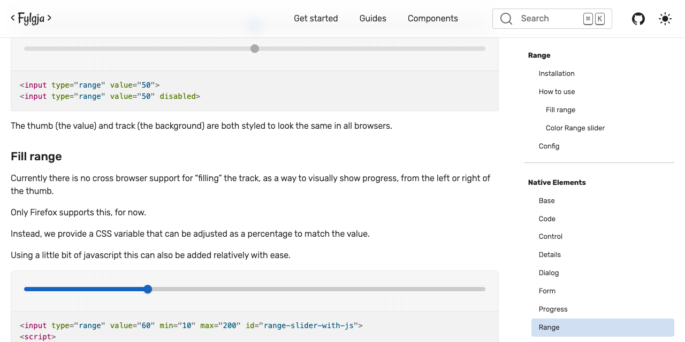
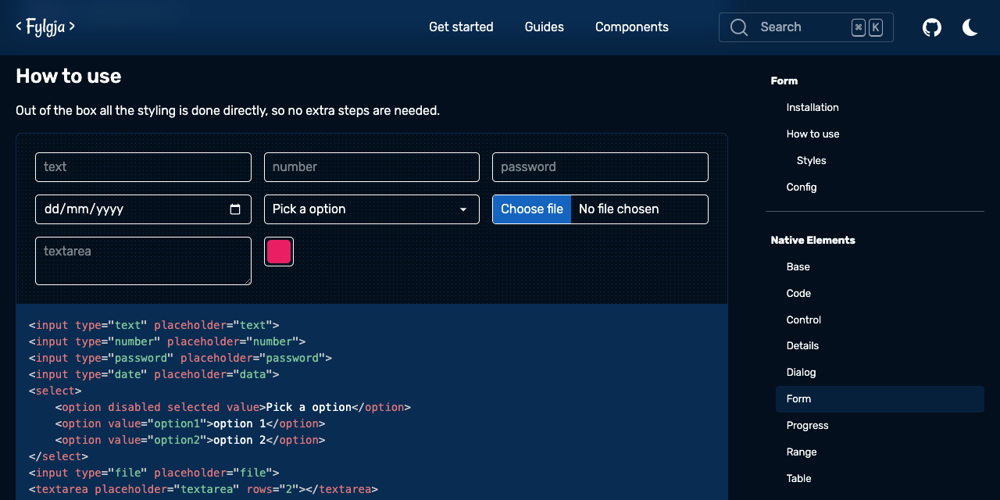

The second minor version of Fylgja has been released, and it includes some significant updates.

So what has changed between Fylgja v1.1 and v1.2.

- [Slim down existing components](#slim-down-existing-components)
- [New Native CSS Components, The Range Slider](#new-native-css-components-the-range-slider)
- [CSS props are here!](#css-props-are-here)
- [Preview components directly on Fylgja.dev](#preview-components-directly-on-fylgjadev)
- [And more!](#and-more)

## Slim down existing components

First, we have started working on enhancing the already-existing components by organising the code and rearranging it.

This introduces some improvements without compromising the exciting code base and reduces the size of the components.

As a result, many CSS components now have SCSS mixin options, which makes it simpler to use the strong foundation on your own class- or scope-specific styles.

## New Native CSS Components, The Range Slider

New to the block is the HTML Input Range Slider.

The Range slider will work out of the box if you load the `@fylgja/range` and use in your html the `<input type=range>`.



[Check out the Fylgja Range Component](/library/components/form-extend/#range-element)

## CSS props are here!

Surprise, surprise Fylgja has also added CSS props!

Despite the fact that Fylgja already integrates seamlessly with other CSS Props (Design Tokens) systems, such as [Open Props](https://open-props.style/) or [Pollen](https://www.pollen.style/modules/ui).

Additionally, we at Fylgja wanted to support our own version.

The Fylgja version will primarily concentrate on keeping the tokens straightforward, so there won't be any tokens with values that are exactly one to one.

With v1.2, we now provide;

- Colors
- Easing (transitions)
- Media Query tokens, based and part of the Mq component
- Shadow
- Sizes, for not just sizes but also typography and spacing.
- Z-layer (z-index)

[Check out the Fylgja CSS Props](/library/tokens/) for what is available.

## Preview components directly on Fylgja.dev

Even though we do provide this, we learned from user feedback that visitors were unable to find any demos or previews.

As a result, in addition to the already present view demo buttons, we are rolling out previews for each component, with few all ready live.



## And more!

- New bundle option for the CSS props
- Fixed import issue for utilpack [#40](https://github.com/fylgja/fylgja/issues/40)
- Fixed iOS selectbox has overflow when the text is to large for the box [#66](https://github.com/fylgja/fylgja/issues/66)
- Introduced `@layer` support for **auto-grid**, **button**, **container** and **stretched-link**, trough separate import, this will make it easier to be used Tailwind's `@apply`.

## Get the latest release

With Node;

```bash
npm install @fylgja@1.2
```

CDN:

```html
<link href="https://unpkg.com/fylgja@1.2/fylgja.css" rel="stylesheet">
```

or get each CSS Component separately on the [Fylgja Components page](https://fylgja.dev/components/) as intended.
